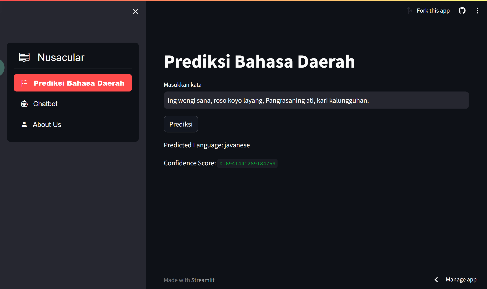
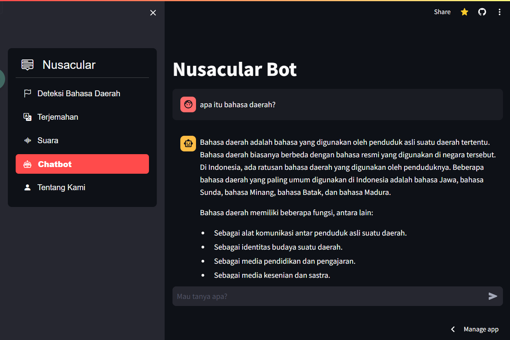
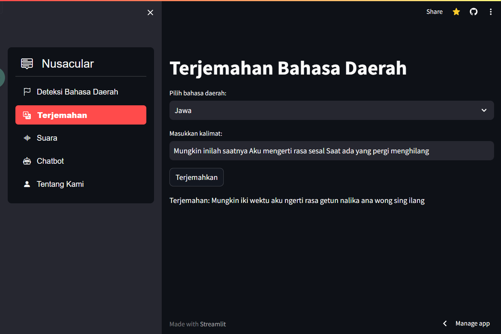
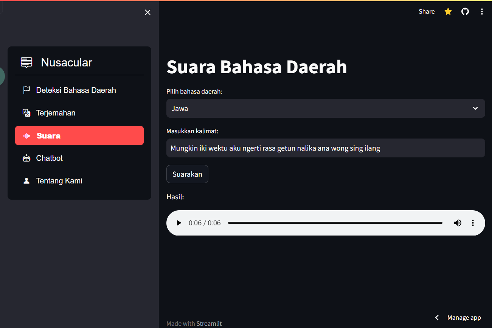
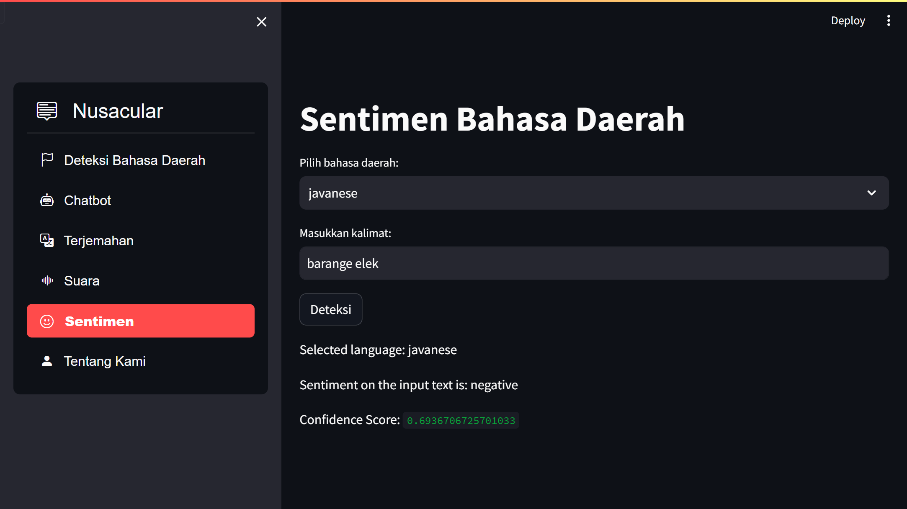

# Nusacular (Nusantara Vernacular)
This project aims to develop a system capable of detecting regional languages or dialects from text. We will collect a dataset containing text in various regional languages or dialects and train machine learning models to recognize and classify them. The outcome will be useful for text processing applications that require an understanding of regional languages and for the preservation of local culture.

## 📷 Features
### Regional Language Detection:
Made using a Naive Bayes classifier and a TF-IDF vectorizer. The model is trained using a dataset from NusaX containing 10,000 sentences in 10 regional languages. The model is able to detect 10 regional languages correctly. 

### Chatbot:
Made using the Gemini (Google Generative AI) API. The user can chat with the chatbot in the context of regional languages.

### Regional Language Translation:
Made using the GoogleTrans library. The library is able to translate from Indonesian into Javanese and Sundanese.

### Text to Speech:
Made using the gTTS (Google Text-to-Speech) library. The library is able to convert text into speech in Javanese and Sundanese languages.

### Sentiment Analysis:
The feature is based on this [notebook](https://github.com/IndoNLP/nusax/blob/main/code/notebook/sentiment_analysis_nusax_classical.ipynb). Users can input a sentence, and the model will predict the sentiment of the given sentence.

## 🎌 Supported Regional Languages:
- Acehnese
- Balinese
- Banjarese
- Buginese
- Javanese
- Sundanese
- Madurese
- Minangnese
- Ngajunese
- Toba Batak

## 🔮 Future Improvements:
- [x] Increase model accuracy
- [x] Add more language
- [ ] Feature to create an account
- [ ] Use an online database

## ✨ Author:
|             Name            |      NIM       |
| --------------------------- | -------------- |
| Bima Rakajati               | A11.2020.13088 |
| Enrico Zada                 | A11.2020.12972 |
| Rosalia Natal Silalahi      | A11.2020.13084 |
| Devi Kartika Sari           | A11.2020.12518 |

## 📙 Reference:
- https://github.com/akhiilkasare/Language-Detection-Using-NLP-and-Machine-Learning
- https://github.com/IndoNLP/nusax